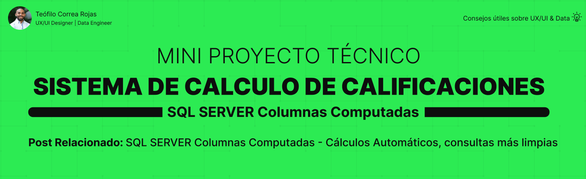

Este mini proyecto técnico está diseñado para explorar el uso de **columnas computadas** (`Computed Columns`) en SQL Server, aplicadas a un sistema académico de evaluación.

---

## 📌 Contexto del Sistema
El objetivo es **automatizar el cálculo de la nota final** de los estudiantes a partir de sus calificaciones individuales (Examen 1, Examen 2, Participación y Asistencia), manteniendo un modelo de base de datos limpio, profesional y validado.

---

## 📚 Contenido de Documentación

- 📌 [Contexto del Sistema](docs/contexto_sistema.md)
- 🗂 [Documento Conceptual](docs/documento_conceptual.md)
- 📊 [Documento Lógico](docs/documento_logico.md)
- 🔗 [Relaciones y Reglas de Integridad](docs/relaciones_tablas.md)
- 🔒 [Seguridad y Metadatos](docs/seguridad_metadatos.md)
- 💻 [Implementación y Pruebas](docs/implementacion_pruebas.md)
- 🚀 [Release](docs/release.md)

## 🗄 Scripts SQL

- 📄 [01 – Creación de estructura (DDL)](sql/01_ddl_creacion_estructura.sql)
- 📄 [02 – Datos de prueba (DML Insert)](sql/02_dml_datos_prueba.sql)
- 📄 [03 – Actualización y eliminación (DML Update/Delete)](sql/03_dml_actualizacion_eliminacion.sql)
- 📄 [04 – Consultas básicas (DQL)](sql/04_dql_consultas_basicas.sql)
- 📄 [05 – Consultas avanzadas (DQL)](sql/05_dql_consultas_avanzadas.sql)

---

## 👤 Autor

**Teófilo Correa Rojas**  
UX/UI Designer • Data Engineer
[LinkedIn](https://www.linkedin.com/in/teófilo-correa-rojas/) · [GitHub](https://github.com/teofilocorrea)

---