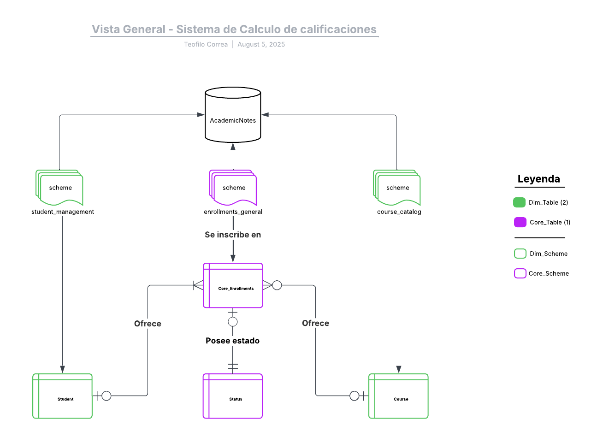

## 📄 Documento Conceptual

Este documento representa el **modelo conceptual** del sistema, donde se definen las entidades principales y sus relaciones lógicas, sin entrar aún en detalles técnicos como tipos de datos o claves primarias.

## 🧩 Entidades identificadas

- **Students**: Representa a los estudiantes que forman parte del sistema.
- **Core_Enrollments**: Registra la inscripción de un estudiante a un curso, incluyendo su desempeño académico.
- **Courses**: Catálogo de cursos disponibles dentro de la institución.
- **Status**: Catálogo para normalizar el estado de una inscripción (ej. Activo, Retirado, Finalizado).

## 🔗 Relaciones destacadas

- Un `Student` puede tener muchas `Core_Enrollments`.
- Un `Course` puede tener muchas `Core_Enrollments`.
- Cada `Core_Enrollment` tiene un `Status` asociado.

Estas relaciones permiten representar el proceso completo de inscripción, asignación de estado y vínculo con el curso correspondiente.

## 🟣 Tabla principal (Core Table)

La entidad **Core_Enrollments** es el centro de este modelo, ya que conecta directamente a estudiantes con cursos y contiene la lógica de evaluación. Esta tabla será clave para las funcionalidades de cálculo de calificaciones.

## 🗂 Organización lógica del sistema

Para promover una estructura clara y escalable, el modelo conceptual contempla una organización modular por **esquemas** dentro de una única base de datos llamada `AcademicNotes`.

- **student_management**: Contiene la entidad `Students`.
- **course_catalog**: Contiene la entidad `Courses`.
- **enrollments_general**: Contiene las entidades `Core_Enrollments` y `Status`.

Esta separación por esquemas facilita la administración, documentación, control de accesos y crecimiento estructurado del modelo de datos.