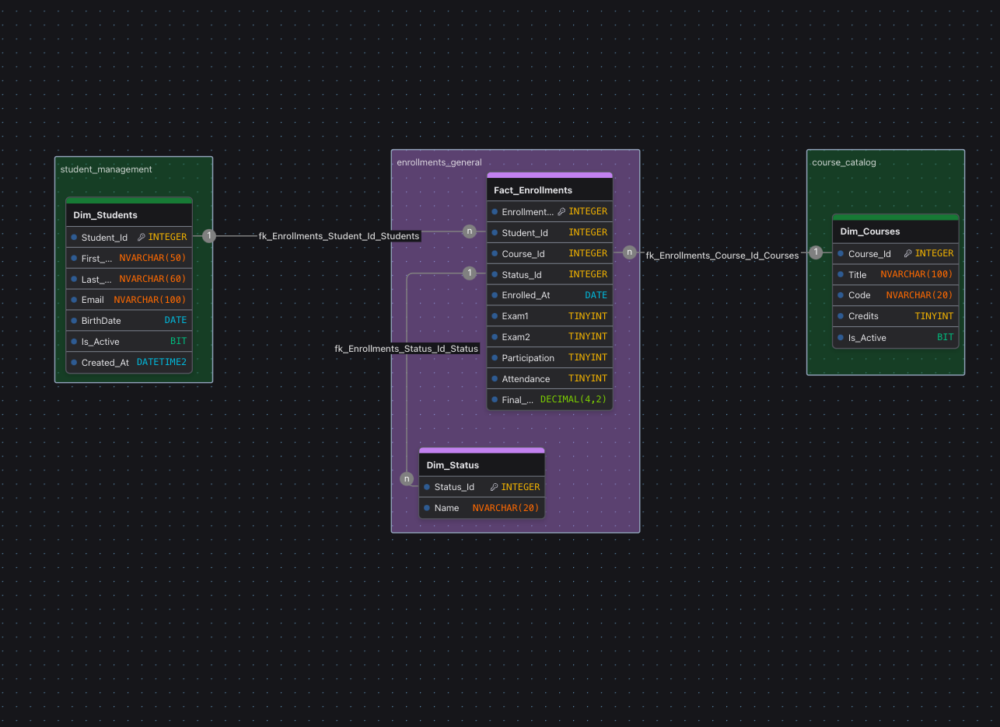

# 📐 Documento Lógico



Este documento representa la estructura lógica del sistema, enfocada en la automatización del cálculo de calificaciones.  
A diferencia de un modelo académico completo, aquí se priorizan los componentes necesarios para aplicar y demostrar el uso de **columnas computadas** en SQL Server.

---

## 📂 Esquemas
- `[student_management]` — Esquema que contiene la tabla de estudiantes (Dim).
- `[course_catalog]` — Esquema que contiene la tabla de catálogo de cursos (Dim).
- `[enrollments_general]` — Esquema que contiene la tabla de inscripciones (Fact).

> Puedes unificar esquemas si el proyecto es pequeño. Mantenerlos separados da claridad y escalabilidad.

---
## 📂 Esquema: `student_management`

## 🧩 Dim_Students
| Campo      | Tipo          | Nulo | Regla / Restricción | Descripción                               |
|------------|---------------|------|---------------------|-------------------------------------------|
| Student_Id | INT IDENTITY  | NO   | PK CLUSTERED        | Identificador único del estudiante        |
| First_Name | NVARCHAR(50)  | NO   | CHECK Latino Name   | Primer nombre                             |
| Last_Name  | NVARCHAR(60)  | NO   | CHECK Latino Name   | Apellido                                  |
| Email      | NVARCHAR(100) | SÍ   | CHECK Email, UNIQUE | Correo electrónico                        |
| BirthDate  | DATE          | NO   | CHECK Edad 15 a 90  | Fecha de nacimiento                       |
| Is_Active  | BIT           | NO   |                     | Estado activo/inactivo                    |
| Created_At | DATETIME2     | NO   | CHECK BETWEEN       | Fecha de creación del registro            |

> **Notas:** especificar si hay índices adicionales, restricciones únicas o patrones (ej. validación de email).

---
## 📂 Esquema: `course_catalog`

## 🧩 Dim_Courses
| Campo     | Tipo          | Nulo | Regla / Restricción       | Descripción                    |
|-----------|---------------|------|---------------------------|--------------------------------|
| Course_Id | INT IDENTITY  | NO   | PK CLUSTERED              | Identificador único del curso  |
| Title     | NVARCHAR(100) | NO   | CHECK Latino Name, UNIQUE | Nombre del curso               |
| Code      | CHAR(5)       | NO   | CHECK Code Format         | Código del curso               |
| Credits   | TINYINT       | NO   | CHECK Menor a 10          | Créditos académicos            |
| Is_Active | BIT           | NO   |                           | Estado activo/inactivo         |

---
## 📂 Esquema: `enrollments_general`

## 🧩 Dim_Status
| Campo     | Tipo          | Nulo | Regla / Restricción                | Descripción                               |
|-----------|---------------|------|------------------------------------|-------------------------------------------|
| Status_Id | INT IDENTITY  | NO   | PK CLUSTERED                       | Identificador del estado                  |
| Name      | NVARCHAR(20)  | NO   | CHECK Validation(Activo, Retirado) | Nombre del estado (activo, retirado, etc) |

---
## 📂 Esquema: `enrollments_general`

## 🧩 Fact_Enrollments (Tabla Core)
| Campo         | Tipo          | Nulo | Regla / Índices                    | Descripción                                                                                                     |
|---------------|---------------|------|------------------------------------|-----------------------------------------------------------------------------------------------------------------|
| Enrollment_Id | INT IDENTITY  | NO   | PK CLUSTERED                       | Identificador de inscripción                                                                                    |
| Student_Id    | INT           | NO   | FK → Dim_Students                  | FK al estudiante                                                                                                |
| Course_Id     | INT           | NO   | FK → Dim_Courses                   | FK al curso                                                                                                     |
| Status_Id     | INT           | NO   | FK → Dim_Status                    | FK al estado                                                                                                    |
| Enrolled_At   | DATE          | NO   | CHECK BETWEEN DATE                 | Fecha de inscripción                                                                                            |
| Exam1         | TINYINT       | NO   | CHECK BETWEEN(0 a 100)             | Calificación examen 1 (0–100)                                                                                   |
| Exam2         | TINYINT       | NO   | CHECK BETWEEN(0 a 100)             | Calificación examen 2 (0–100)                                                                                   |
| Participation | TINYINT       | NO   | CHECK BETWEEN(0 a 100)             | Participación (0–100)                                                                                           |
| Attendance    | TINYINT       | NO   | CHECK BETWEEN(0 a 100)             | Asistencia (0–100)                                                                                              |
| Final_Grade   | DECIMAL(4,2)  | NO   | **COMPUTED PERSISTED** (si aplica), CHECK CALIFICATION | Nota final calculada a partir de Exam1, Exam2, Participation y Attendance. PERSISTED para optimizar consultas.  |

> **Fórmula computada sugerida (si aplica):**  
> ```sql
> ROUND(
>     (COALESCE(Exam1,0) * 0.40) +
>     (COALESCE(Exam2,0) * 0.40) +
>     (COALESCE(Participation,0) * 0.10) +
>     (COALESCE(Attendance,0) * 0.10),
>     2
> )
> ```
> Ajustar según la regla de negocio.

---

## 🔗 Relaciones principales
- `[Dim_Students]` puede tener muchas `[Fact_Enrollments]`.
- `[Dim_Courses]` puede tener muchas `[Fact_Enrollments]`.
- `[Fact_Enrollments]` referencia catálogos o tablas de detalle, como `[Dim_Status]`.

---

## ⚖ Acciones FK recomendadas
| FK Name                             | Tabla Hija        | Tabla Padre      | ON DELETE | ON UPDATE | Justificación breve                                                                                    |
|-------------------------------------|-------------------|------------------|-----------|-----------|--------------------------------------------------------------------------------------------------------|
| fk_Enrollments_Status_Id_Status     | Fact_Enrollments  | Dim_Status       | NO ACTION | NO ACTION | El catálogo de estados es fijo. No debe permitir cascadas al eliminar valores.                         |
| fk_Enrollments_Course_Id_Courses    | Fact_Enrollments  | Dim_Courses      | NO ACTION | NO ACTION | Se requiere conservar el historial de inscripciones aunque un curso se elimine.                        |
| fk_Enrollments_Student_Id_Students  | Fact_Enrollments  | Dim_Students     | NO ACTION | NO ACTION | Proteger el historial académico. Eliminar un estudiante no debe afectar las inscripciones existentes.  |

> **Guía rápida:**  
> - **CASCADE**: cuando el hijo no tiene sentido sin el padre.  
> - **SET NULL**: para conservar registros sin vínculo activo.  
> - **NO ACTION**: cuando se preserva historial o integridad estricta.

---

## 🧮 Columna Computada (si aplica)

```sql
ALTER TABLE enrollments_general.Fact_Enrollments
ADD Final_Grade AS 
    ((Exam1 * 0.40) + (Exam2 * 0.40) + (Participation * 0.10) + (Attendance * 0.10))
    PERSISTED;
